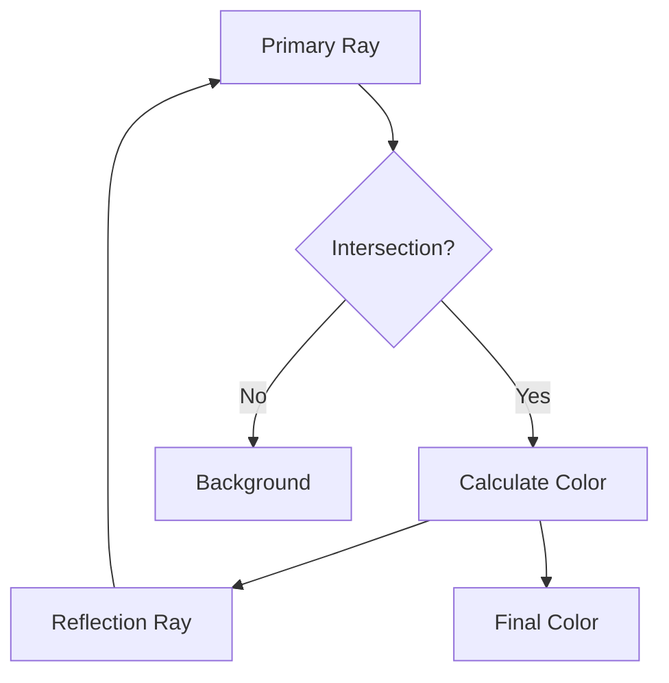
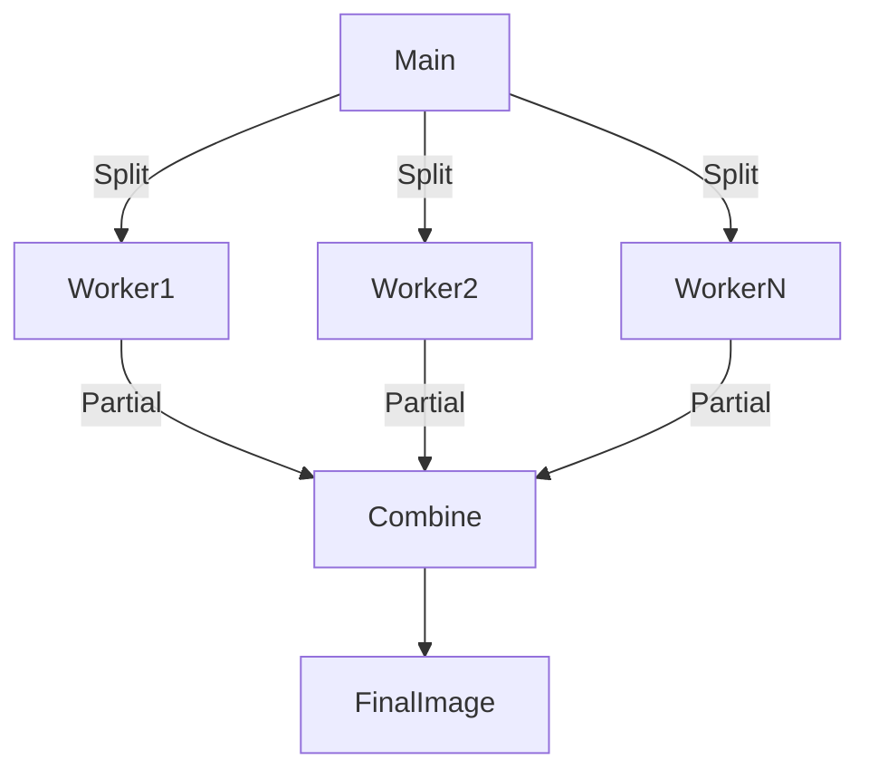

# Ray Tracer Technical Documentation

## Table of Contents
1. [Mathematical Foundations](#mathematical-foundations)
2. [Core Algorithms](#core-algorithms)
3. [Implementation Details](#implementation-details)
4. [Performance Considerations](#performance-considerations)

---

## Mathematical Foundations

### 1. Ray-Sphere Intersection

**Sphere Equation**  
```math
(\mathbf{P} - \mathbf{C}) \cdot (\mathbf{P} - \mathbf{C}) = r^2
```

**Ray Equation**  
```math
\mathbf{R}(t) = \mathbf{O} + t\mathbf{D},\quad t > 0
```

**Intersection Calculation**  
Quadratic coefficients:
```math
\begin{align*}
a &= \mathbf{D} \cdot \mathbf{D} \\
b &= 2\mathbf{D} \cdot (\mathbf{O}-\mathbf{C}) \\
c &= (\mathbf{O}-\mathbf{C}) \cdot (\mathbf{O}-\mathbf{C}) - r^2
\end{align*}
```

Root calculation:
```math
t = \frac{-b \pm \sqrt{b^2 - 4ac}}{2a}
```

### 2. Phong Illumination Model
```math
I = I_{\text{ambient}} + I_{\text{diffuse}} + I_{\text{specular}}
```

Components:
```math
\begin{align*}
I_{\text{ambient}} &= k_a \cdot i_a \\
I_{\text{diffuse}} &= k_d \cdot (\mathbf{N} \cdot \mathbf{L}) \cdot i_d \\
I_{\text{specular}} &= k_s \cdot (\mathbf{N} \cdot \mathbf{H})^{\alpha} \cdot i_s
\end{align*}
```

### 3. Recursive Reflections
Reflection direction:
```math
\mathbf{R} = \mathbf{D} - 2(\mathbf{D} \cdot \mathbf{N})\mathbf{N}
```

Recursive equation:
```math
C_{\text{total}} = C_{\text{surface}} + k_r \cdot C_{\text{reflection}}
```

---

## Core Algorithms

### Ray Tracing Pipeline


### Multiprocessing Architecture


---

## Implementation Details

### Coordinate System
Screen space conversion:
```math
\begin{align*}
x_{\text{ndc}} &= -1 + \frac{2i}{w-1} \\
y_{\text{ndc}} &= -\frac{1}{ar} + \frac{2j}{h \cdot ar}
\end{align*}
```

### Code Structure
**Main Render Method**:
```python
def render(self, scene: Scene, processes: int = 1) -> Image:
    if processes > 1:
        return self._render_multiprocess(scene, processes)
    return self._render_single_process(scene)
```

**Intersection Calculation**:
```python
def intersects(self, ray: Ray):
    sphere_to_ray = ray.origin - self.center
    b = 2 * ray.direction.dot(sphere_to_ray)
    c = sphere_to_ray.dot(sphere_to_ray) - self.radius**2
    discriminant = b**2 - 4 * c
    # Root selection logic
```

**Phong Shading**:
```python
def color_at(self, obj_hit, hit_pos, scene, hit_normal):
    # Diffuse component
    diffuse = max(hit_normal.dot(light_dir), 0)
    # Specular component
    half_vec = (light_dir + view_dir).normalize()
    specular = max(hit_normal.dot(half_vec), 0) ** 50
```

---

## Performance Considerations

### Complexity Analysis
```math
\begin{align*}
\text{Time} &= O(w \cdot h \cdot m \cdot (k+1)) \\
\text{Space} &= O(w \cdot h + p)
\end{align*}
```

### Optimization Techniques
1. Spatial partitioning (BVH)
2. SIMD vectorization using NumPy
3. Early ray termination
4. Material caching
5. Multithreaded task queues

---